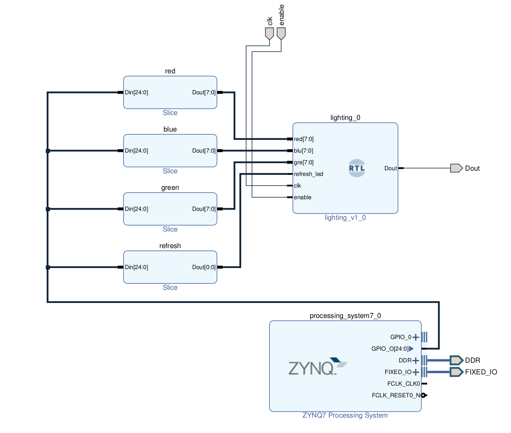

# WS2812b or Neopixel Driver for PYNQ-Z2 [Issues Present]
## An implementation of NeoPxl driver 
Finally a dynamic controller which is easy to implement and use.

This is an ambitious project for a me (beginner) who is trying to find my ways in the Digital VLSI world.
Due to the complications, I found while testing, I had to exclude spexify[0 7] which would have individually lit the led.

Issues Deteccted on WS2812b Led drivers. while testing there seems to have some discrepancies with the lighting. They generally remain in the range of acceptable error, ie x value will only produce x color, the issue is in the brightness which seems to be messed up. These will be updated when i get back to it.

## External Pin Layout
* Dout -> AR[0]
* enable -> SW0
* clk  -> H16 Pin from Eth PHY

## Internal Pin Layout
* green -> GPIO[0 7]
* red -> GPIO[8 15]
* blue -> GPIO[16 23]
* refresh_led -> 24

refresh_led is supposed to be toggled inorder for the color to be absorbed into the module. 
I use PYNQ PS to input the RGB values to the module 

## The Function implemented will accept (6-byte hex color value) 

### Jupyter notebooks are shared having helper functions to help control the LEDs
This is based on Project of mine based on Lightdriver by anfractuosity modeled on a 
circular ws2812b ring consisting of 24 LEDs

Demo is given Below.

Source is [pynq_ws2812b_anfry](https://github.com/ZeroX29a/pynq_ws2812b_anfry)
